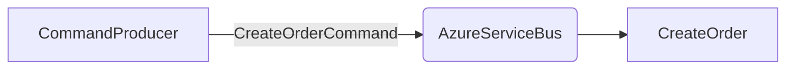
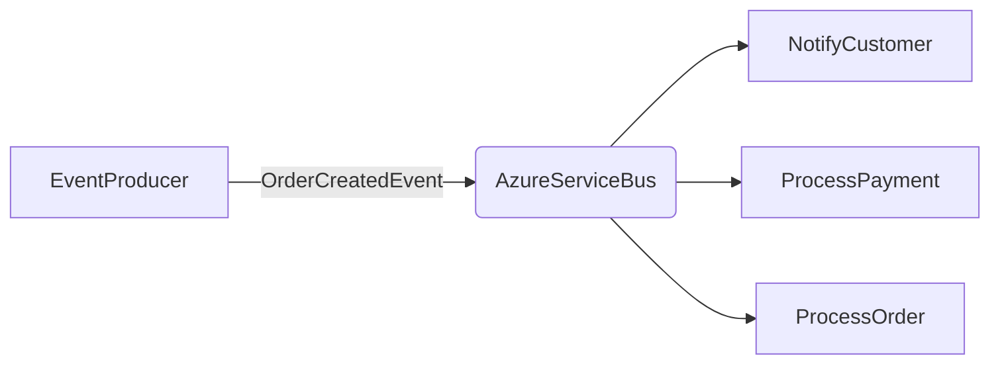

# Commands and Events

In **AzureServiceBusFlow**, messages are generally divided into two conceptual categories: **Commands** and **Events**.

Although they are represented in code using the same message structures, their **purpose and meaning** differ from an architectural perspective.

 

## ✒️ Commands

A **command** expresses the **intention to perform an action**.

It usually represents a request from one part of the system asking another to execute a specific operation.  
Commands are **imperative** — they tell the system *what should be done*.

Examples:
- `CreateOrderCommand`
- `UpdateUserProfileCommand`
- `ProcessPaymentCommand`

A command typically has a **single intended consumer**, as it represents a direct request that must be handled once.
**It is possible to configure more than one consumer for a command, although this approach is more commonly applied to events.*

 

## 🔔 Events

An **event** indicates that **something has already happened**.

It is a **notification** sent to inform other parts of the system that a specific state change occurred.  
Events are **descriptive** — they tell the system *what has happened*.

Examples:
- `OrderCreatedEvent`
- `UserProfileUpdatedEvent`
- `PaymentProcessedEvent`

Unlike commands, events are often **broadcast** to multiple subscribers, allowing different services to react independently.

 

## 🧩 Architectural Difference

|  | **Command** | **Event** |
| :------- | :----------- | :--------- |
| Meaning | Intention to perform an action | Notification that something occurred |
| Temporal Aspect | Future-oriented | Past-oriented |
| Consumer Count | *Usually one | One or many |
| Communication Type | Point-to-point | Publish-subscribe |
| Example | `CreateOrderCommand` | `OrderCreatedEvent` |

 

> 💡 Although they share the same implementation in code, their **semantic purpose** defines whether a message should be treated as a command or an event.

> 💡* Even though it is technically possible to have multiple **consumers** for the same **message**, this is not a common pattern for commands. A **command** represents a specific intent to perform a single action, typically handled by one consumer. **Events**, on the other hand, are better suited for multiple consumers, since they signal that something has already happened and can notify several parts of the system independently.
