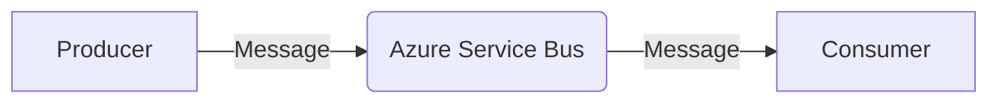

# Messages and Azure Service Bus Overview

**Azure Service Bus** is a fully managed enterprise messaging system that enables reliable communication between distributed applications.  
It decouples application components, allowing them to exchange messages in a secure and asynchronous manner.

In **AzureServiceBusFlow (AsbFlow)**, a **message** represents the fundamental unit of communication between different parts of the system.  
Messages can be commands, events, or any other type of information that needs to be transmitted through queues or topics.

 

## 📦 What Is a Message?

A **message** is a piece of data sent from one application or service to another. It can represent:
- A request to perform an operation
- A notification that something has occurred
- Data exchange between microservices

 

## 🔄 Message Flow

1. A **producer** sends a message to a queue or topic.
2. The **Azure Service Bus** stores and delivers the message reliably.
3. A **consumer** receives the message and processes it.

 

 

This architecture ensures asynchronous, loosely coupled communication, improving scalability and resilience in distributed systems.

## 🚀 AsbFlow’s Role

**AzureServiceBusFlow** simplifies the process of defining and managing these messages by:
- Providing a clean, strongly typed model for message definition
- Enforcing consistent configuration patterns for message producers and consumers
- Allowing automatic setup of queues, topics, and subscriptions
