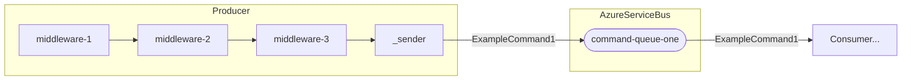

# **Middlewares**

In the context of `AzureServiceBusFlow`, **Middlewares** are components that run before a message is sent to Azure Service Bus.

They allow you to intercept, inspect, or modify the ServiceBusMessage — for example, adding custom properties, performing logging, or applying transformations — without changing the core sending logic.

Each middleware **executes in sequence** through a pipeline, and after all have finished, the message is finally delivered to Azure Service Bus.

<br>

## 🧩 Middleware Interface

AsbFlow defines a interface for creating custom middlewares. 

```csharp
public interface IProducerMiddleware
{
    Task InvokeAsync(ServiceBusMessage message, Func<Task> next);
}
```

This interface defines a single method, InvokeAsync, which receives:

- The `ServiceBusMessage` being processed.
- A delegate `next`, which represents the next middleware in the pipeline or the final send operation.

<br>

### 🧱 Example of Middleware
```csharp
public class AsbSampleMiddleware : IProducerMiddleware
{
    public async Task InvokeAsync(ServiceBusMessage message, Func<Task> next)
    {
        // Add a custom property if it doesn't exist
        if (!message.ApplicationProperties.ContainsKey("SampleMiddleware"))
        {
            message.ApplicationProperties["SampleMiddleware"] = "Executed";
        }

        // Add a UTC timestamp for debugging or tracking
        message.ApplicationProperties["ProcessedAtUtc"] = DateTime.UtcNow.ToString("O");

        // Continue the pipeline (invoke the next middleware or the actual send)
        await next();
    }
}
``` 
This sample middleware demonstrates how to enrich a message before it is published.
It adds two custom properties:

- `"SampleMiddleware"` – a flag indicating that the middleware has executed.
- `"ProcessedAtUtc"` – a timestamp showing when the message was processed.

By calling `await next()`, it ensures the next middleware (or the send operation) is executed, maintaining the correct order of the pipeline.

<br>

## ⚙️ Registering the Middleware in the Pipeline

Once your middleware is implemented, you can easily register it in the producer pipeline through the UseMiddleware<TMiddleware>() extension method in your Program.cs:

```csharp
builder.Services.AddAzureServiceBus(cfg => cfg
    .ConfigureAzureServiceBus(azureServiceBusConfig)
    .AddProducer<ExampleCommand1>(p => p
        .EnsureQueueExists("command-queue-one")
        .WithCommandProducer()
        .UseMiddleware<AsbSampleMiddleware>()
        .ToQueue("command-queue-one")));
```

In this example:

The `AsbSampleMiddleware` will be executed every time a message is produced for the queue command-queue-one.

Multiple middlewares can be chained by calling UseMiddleware multiple times — they are executed in the same order they are added.

