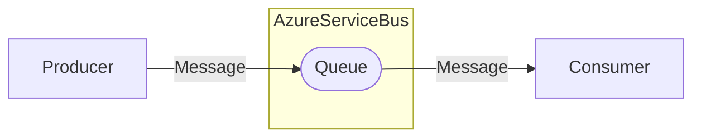
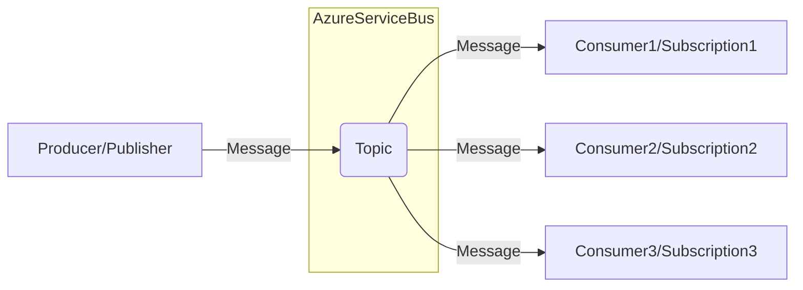

# Queues and Topics

**Azure Service Bus** provides two main types of messaging entities — **queues** and **topics** — each suited for specific communication patterns.

 

## 📥 Queues

A **queue** is a simple, point-to-point communication channel.

- Each message is received by **only one** consumer.
- Messages are stored until a consumer successfully processes them.
- Ideal for **command processing** or **task-based** workloads.

Example use cases:
- Order processing
- Email sending jobs
- Background task execution

 

## 📢 Topics and Subscriptions

A **topic** enables a **publish-subscribe** messaging pattern.

- Producers send messages to a topic.
- Multiple **subscriptions** can be attached to a topic.
- Each subscription receives a **copy** of the message.
- Ideal for **event broadcasting** or **system-wide notifications**.

Example use cases:
- Notifying multiple microservices about an order creation
- Updating caches after a data change
- Triggering independent workflows after an event

 

## 🧩 Summary

| Feature | **Queue** | **Topic** |
| :------- | :--------- | :--------- |
| Pattern | Point-to-point | Publish-subscribe |
| Consumers per message | One | Many (via subscriptions) |
| Typical usage | Commands | Events |
| Message copy | Single | One per subscription |

> **AsbFlow** automatically configures queues, topics, and subscriptions for you, making setup and maintenance straightforward.
