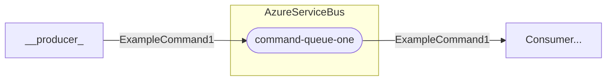

# Producers

To simplify the process of sending messages to Azure Service Bus, we created an abstraction that encapsulates the publishing logic.

This approach keeps the implementation consistent and allows any type of message to be sent using the same pattern.

<br>

## ⚙️ Registering a Producer

### Sending Messages to a Queue

To register a producer and configure which message it will send, use the **`AddProducer()`** method inside the **`AddAzureServiceBus()`** configuration method in **`Program.cs`**:

```csharp
builder.Services.AddAzureServiceBus(cfg => cfg
    .ConfigureAzureServiceBus(azureServiceBusConfig)
    .AddProducer<ExampleCommand1>(p => p
        .EnsureQueueExists("command-queue-one")
        .WithCommandProducer()
        .ToQueue("command-queue-one")));
```

The code above registers a producer for the **`ExampleCommand1`** Message created earlier in this documentation ([ExampleCommand1](/docs/creatingMessages.html)).
- **`EnsureQueueExists()`**: Ensures that the specified **Queue** exists in Azure Service Bus. If the **Queue** does not exist, it will be created automatically.
- **`WithCommandProducer()`**: Specifies that the producer is of type **CommandProducer**. Alternatively, you can configure an **EventProducer** or a **CommandProducer**, depending on the message type.  
- **`ToQueue()`**: Defines the **Queue** where the message will be published.

### Sending Messages to a Topic
If you want the producer to publish messages to a **Topic** instead of a Queue, you can use the methods **`EnsureTopicExists()`** and **`ToTopic()`** in the same configuration pattern:

```csharp
builder.Services.AddAzureServiceBus(cfg => cfg
    .ConfigureAzureServiceBus(azureServiceBusConfig)
    .AddProducer<ExampleEvent1>(p => p
        .EnsureTopicExists("event-topic-one")
        .WithEventProducer()
        .ToTopic("event-topic-one")));
```

- **`EnsureTopicExists()`**: Ensures that the specified Topic exists in Azure Service Bus. If the Topic does not exist, it will be automatically created.
- **`WithEventProducer()`**: Specifies that the producer is of type **EventProducer**. Alternatively, you can configure an **CommandProducer** or a **EventProducer**, depending on the message type.  
- **`ToTopic()`**: Defines the Topic where the message will be published.

<br>

## 📤 Publishing Messages 

Once the producer is configured, it can be used to publish messages to the bus. Here’s an example of how to do it.

> To publish a message as a **Command**, inject an instance of **`ICommandProducer`** and call **`ProduceCommandAsync()`**, passing the message as a parameter.  
>  
> To publish a message as an **Event**, do the same using **`IEventProducer`** and call **`ProduceEventAsync()`**.


```csharp
[Route("api/commands")]
[ApiController]
public class CommandController(ICommandProducer<ExampleCommand1> _producer) : ControllerBase
{
    [HttpPost("command-example-one")]
    public async Task<IActionResult> Example1(CancellationToken cancellationToken)
    {
        ExampleCommand1 command = new()
        {
            ExampleMessage = new ExampleMessage
            {
                Cliente = "jose",
                Id = Guid.NewGuid(),
                Valor = 1111
            }
        };

        await _producer.ProduceCommandAsync(command, cancellationToken);
        return Ok();
    }
}
```

The flowchart below shows the flow of sending the message created in the previous example.



<br>

## 🧭 Summary
- **💬 Message** created
- **📤 Producer** configured
- **📬 Queue** or **Topic** created and registred

Next step: **[Create MessageHandler](/docs/creatingConsumers.html)** to consume and process the message.